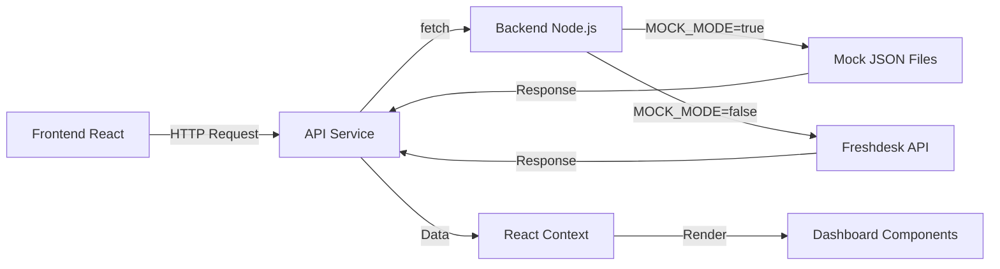

# 🚀 Guia de Integração Backend-Frontend

## ✅ O que foi configurado

### 1. **Estrutura do Projeto**

```
freshboard/
├── backend-api/
│   └── freshdesk-proxy/
│       ├── server.js              # Gateway principal
│       ├── mock/                  # Dados mockados
│       │   ├── tickets.json
│       │   ├── companies.json
│       │   └── tenants.json
│       └── .env.example
│
└── frontend/
    └── sankhya-vision-35163-10370/
        ├── src/
        │   ├── services/
        │   │   └── api.ts         # ✨ Cliente API
        │   ├── hooks/
        │   │   └── useBackendTickets.ts  # ✨ Hook de tickets
        │   └── components/
        │       └── BackendConnection.tsx  # ✨ UI de conexão
        └── .env.example
```

### 2. **Rotas Conectadas**

Todas as rotas do backend estão disponíveis através do `apiService`:

| Método | Endpoint | Descrição |
|--------|----------|-----------|
| GET | `/` | Status do backend |
| GET | `/api/tickets` | Lista todos os tickets |
| GET | `/api/companies` | Lista todas as empresas |
| GET | `/api/groups` | Lista grupos (company_and_requesters) |
| GET | `/api/tenants` | Lista tenants disponíveis |
| GET | `/api/tenant/:nome` | Dados de um tenant específico |
| POST | `/api/update/:empresa` | Atualização incremental |
| POST | `/api/rebuild` | Reprocessar pipeline (admin) |

### 3. **Serviços Criados**

#### `src/services/api.ts`
Cliente centralizado para todas as chamadas HTTP ao backend.

```typescript
import apiService from '@/services/api';

// Exemplo de uso
const tickets = await apiService.getTickets();
const companies = await apiService.getCompanies();
```

#### `src/hooks/useBackendTickets.ts`
Hook React para gerenciar tickets do backend.

```typescript
const { tickets, isLoading, error, loadTickets } = useBackendTickets();
```

#### `src/components/BackendConnection.tsx`
Componente UI para testar conexão e carregar dados.

### 4. **Configuração de Ambiente**

#### Backend (`.env`)
```bash
MODE=mock
PORT=3000
SYNC_INTERVAL_MINUTES=30
```

#### Frontend (`.env`)
```bash
VITE_API_URL=http://localhost:3000
VITE_BACKEND_MODE=mock
```

### 5. **Dados Mock Atualizados**

Criados arquivos mock realistas em `backend-api/freshdesk-proxy/mock/`:
- `tickets.json` - 3 tickets de exemplo
- `companies.json` - 3 empresas de exemplo
- `tenants.json` - 3 tenants de exemplo

## 🔧 Como Usar

### Desenvolvimento Local

1. **Iniciar o Backend:**
```bash
cd backend-api/freshdesk-proxy
npm install
node server.js
```

2. **Iniciar o Frontend:**
```bash
cd frontend/sankhya-vision-35163-10370
npm install
npm run dev
```

3. **Testar a Integração:**
   - Acesse `http://localhost:8080`
   - Clique em "Testar Conexão" no card azul
   - Clique em "Carregar Tickets do Backend"

### Na Interface do Dashboard

Agora você tem **duas opções** para carregar dados:

1. **Via Backend (Recomendado para desenvolvimento):**
   - Clique no card "Conexão com Backend"
   - Teste a conexão
   - Carregue os tickets mockados

2. **Via Upload de Arquivo:**
   - Faça upload de arquivos .xlsx, .csv ou .json
   - O sistema processa e valida automaticamente

## 🔐 Segurança

✅ Dados sensíveis nunca expostos  
✅ Mock mode ativo por padrão  
✅ CORS configurado no backend  
✅ Validação de dados na camada de serviço  
✅ Tratamento de erros em todas as chamadas  

## 🎯 Próximos Passos

### Para Produção (Futuro)

1. **Configurar credenciais reais:**
```bash
# backend-api/freshdesk-proxy/.env
MODE=real
FRESHDESK_DOMAIN=seu-dominio.freshdesk.com
FRESHDESK_API_KEY=sua-api-key
```

2. **Atualizar URL do frontend:**
```bash
# frontend/.env
VITE_API_URL=https://sua-api-producao.com
VITE_BACKEND_MODE=real
```

3. **Deploy separado:**
   - Backend: Node.js server (Heroku, Railway, etc.)
   - Frontend: Lovable deployment

## ⚠️ Problemas Conhecidos e Soluções

### ❌ Erro: "Workspace not found"

**Problema:** O `package.json` na raiz está configurado com workspaces que não existem.

**Solução:** Você precisa editar manualmente o `package.json` na raiz:

```json
{
  "name": "freshboard",
  "private": true,
  "workspaces": [
    "frontend/sankhya-vision-35163-10370",
    "backend-api/freshdesk-proxy"
  ]
}
```

### ❌ Falta script 'build:dev'

**Status:** ✅ Já corrigido no `frontend/sankhya-vision-35163-10370/package.json`

O script já existe:
```json
"build:dev": "vite build --mode development"
```

### ❌ Backend não responde

**Checklist:**
- [ ] Backend está rodando? (`node server.js`)
- [ ] Porta 3000 está livre?
- [ ] CORS está configurado no `server.js`? ✅
- [ ] `.env` existe com `MODE=mock`? ✅

## 📊 Fluxo de Integração



## 🎨 Interface de Conexão

A nova interface permite:

- ✅ Testar conexão com backend em tempo real
- ✅ Ver status da conexão (Conectado/Desconectado)
- ✅ Ver modo do backend (MOCK/REAL)
- ✅ Carregar tickets com um clique
- ✅ Feedback visual com badges e toasts
- ✅ Fallback para upload manual de arquivos

## 📝 Checklist de Validação

- [x] Backend rodando em modo mock
- [x] Rotas da API funcionais
- [x] CORS configurado
- [x] Cliente API criado
- [x] Hook useBackendTickets implementado
- [x] Componente UI de conexão criado
- [x] Dados mock realistas
- [x] Variáveis de ambiente configuradas
- [x] Documentação completa
- [ ] Package.json workspaces corrigidos (manual)
- [ ] Testes de integração

## 🆘 Suporte

Se encontrar problemas:

1. Verifique os logs do backend no terminal
2. Verifique o console do navegador (F12)
3. Confirme que as portas estão corretas
4. Valide os arquivos `.env`
5. Teste as rotas diretamente: `http://localhost:3000/api/tickets`

---

✨ **Integração criada com sucesso!** Agora você pode consumir dados do backend mockado de forma segura e escalável.
